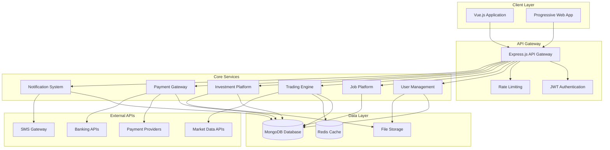
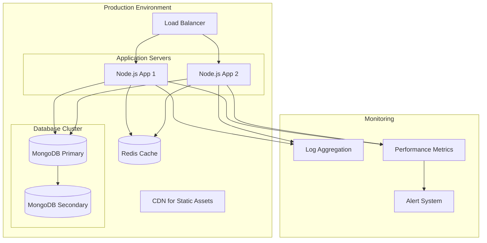

# ZedHustle Platform Architecture

## System Overview

ZedHustle is a comprehensive financial empowerment platform for Zambia, built with a modern web architecture supporting multiple core modules.

## Technology Stack

### Frontend
- **Framework**: Vue.js 3 with Composition API
- **UI Library**: Vuetify or Quasar Framework
- **State Management**: Pinia
- **Charts**: Chart.js or D3.js for trading visualizations
- **Build Tool**: Vite

### Backend
- **Runtime**: Node.js
- **Framework**: Express.js
- **Database**: MongoDB with Mongoose ODM
- **Authentication**: JWT with refresh tokens
- **Real-time**: Socket.io for live data updates
- **File Storage**: AWS S3 or local storage

### External Integrations
- **Market Data**: Alpha Vantage, Yahoo Finance APIs
- **Payments**: Airtel Money API, MTN Mobile Money API
- **Banking**: Local Zambian bank APIs
- **Notifications**: Twilio (SMS), SendGrid (Email)

## System Architecture



## Database Schema Design

### Users Collection
```javascript
{
  _id: ObjectId,
  email: String,
  password: String, // hashed
  profile: {
    firstName: String,
    lastName: String,
    phone: String,
    location: String,
    avatar: String,
    verified: Boolean
  },
  wallet: {
    balance: Number,
    currency: String, // ZMW
    transactions: [ObjectId] // ref to transactions
  },
  tradingAccount: {
    virtualBalance: Number,
    portfolios: [ObjectId] // ref to portfolios
  },
  preferences: {
    notifications: Boolean,
    language: String,
    theme: String
  },
  createdAt: Date,
  updatedAt: Date
}
```

### Jobs Collection (Extended)
```javascript
{
  _id: ObjectId,
  title: String,
  description: String,
  company: String,
  location: String,
  type: String, // full-time, part-time, freelance, contract
  category: String,
  salary: {
    min: Number,
    max: Number,
    currency: String,
    period: String // hourly, daily, monthly
  },
  requirements: [String],
  benefits: [String],
  contactInfo: {
    email: String,
    phone: String,
    whatsapp: String
  },
  employer: ObjectId, // ref to users
  applicants: [ObjectId], // ref to users
  status: String, // active, closed, filled
  featured: Boolean,
  datePosted: Date,
  deadline: Date,
  createdAt: Date,
  updatedAt: Date
}
```

### Investments Collection
```javascript
{
  _id: ObjectId,
  businessName: String,
  description: String,
  category: String,
  location: String,
  fundingGoal: Number,
  currentFunding: Number,
  minimumInvestment: Number,
  expectedReturns: Number,
  timeline: String,
  riskLevel: String, // low, medium, high
  businessPlan: String, // file URL
  financials: String, // file URL
  images: [String],
  owner: ObjectId, // ref to users
  investors: [{
    user: ObjectId,
    amount: Number,
    date: Date,
    status: String // pending, confirmed, paid
  }],
  status: String, // active, funded, closed
  createdAt: Date,
  updatedAt: Date
}
```

### Trading Portfolios Collection
```javascript
{
  _id: ObjectId,
  user: ObjectId, // ref to users
  name: String,
  virtualBalance: Number,
  totalValue: Number,
  totalReturn: Number,
  positions: [{
    symbol: String,
    type: String, // forex, stock, commodity
    quantity: Number,
    entryPrice: Number,
    currentPrice: Number,
    unrealizedPL: Number,
    dateOpened: Date
  }],
  transactions: [{
    type: String, // buy, sell
    symbol: String,
    quantity: Number,
    price: Number,
    date: Date
  }],
  createdAt: Date,
  updatedAt: Date
}
```

### Transactions Collection
```javascript
{
  _id: ObjectId,
  user: ObjectId, // ref to users
  type: String, // deposit, withdrawal, investment, payment
  amount: Number,
  currency: String,
  status: String, // pending, completed, failed, cancelled
  paymentMethod: String, // airtel_money, mtn_money, bank_transfer
  reference: String,
  description: String,
  metadata: Object, // additional data based on transaction type
  createdAt: Date,
  updatedAt: Date
}
```

## API Endpoints Structure

### Authentication
- `POST /api/auth/register` - User registration
- `POST /api/auth/login` - User login
- `POST /api/auth/refresh` - Refresh JWT token
- `POST /api/auth/logout` - User logout
- `POST /api/auth/forgot-password` - Password reset request
- `POST /api/auth/reset-password` - Password reset confirmation

### Jobs
- `GET /api/jobs` - Get all jobs (with filters)
- `POST /api/jobs` - Create new job posting
- `GET /api/jobs/:id` - Get specific job
- `PUT /api/jobs/:id` - Update job posting
- `DELETE /api/jobs/:id` - Delete job posting
- `POST /api/jobs/:id/apply` - Apply for job

### Trading
- `GET /api/trading/market-data` - Get real-time market data
- `GET /api/trading/portfolios` - Get user portfolios
- `POST /api/trading/portfolios` - Create new portfolio
- `POST /api/trading/trade` - Execute virtual trade
- `GET /api/trading/history` - Get trading history

### Investments
- `GET /api/investments` - Get investment opportunities
- `POST /api/investments` - Create investment opportunity
- `GET /api/investments/:id` - Get specific investment
- `POST /api/investments/:id/invest` - Make investment
- `GET /api/investments/my-investments` - Get user's investments

### Payments
- `POST /api/payments/deposit` - Initiate deposit
- `POST /api/payments/withdraw` - Initiate withdrawal
- `GET /api/payments/wallet` - Get wallet balance
- `GET /api/payments/transactions` - Get transaction history
- `POST /api/payments/verify` - Verify payment

## Security Considerations

1. **Authentication & Authorization**
   - JWT tokens with short expiry and refresh mechanism
   - Role-based access control (user, employer, admin)
   - API rate limiting to prevent abuse

2. **Data Protection**
   - Password hashing with bcrypt
   - Input validation and sanitization
   - SQL injection prevention with Mongoose
   - XSS protection with helmet.js

3. **Payment Security**
   - PCI DSS compliance considerations
   - Encrypted payment data storage
   - Secure API communication with payment providers
   - Transaction verification and reconciliation

4. **General Security**
   - HTTPS enforcement
   - CORS configuration
   - Environment variable protection
   - Regular security audits

## Deployment Architecture



## Development Phases

### Phase 1: Foundation (Weeks 1-2)
- Set up development environment
- Implement user authentication
- Create basic Vue.js structure
- Set up database schemas

### Phase 2: Core Features (Weeks 3-6)
- Complete Job Platform
- Implement Trading Platform with virtual portfolios
- Build Investment Platform basic functionality
- Integrate market data APIs

### Phase 3: Payments & Advanced Features (Weeks 7-10)
- Integrate Zambian payment solutions
- Implement wallet system
- Add admin dashboard
- Build notification system

### Phase 4: Testing & Deployment (Weeks 11-12)
- Comprehensive testing
- Security audits
- Performance optimization
- Production deployment

This architecture provides a scalable, secure, and maintainable foundation for ZedHustle's growth in the Zambian market.